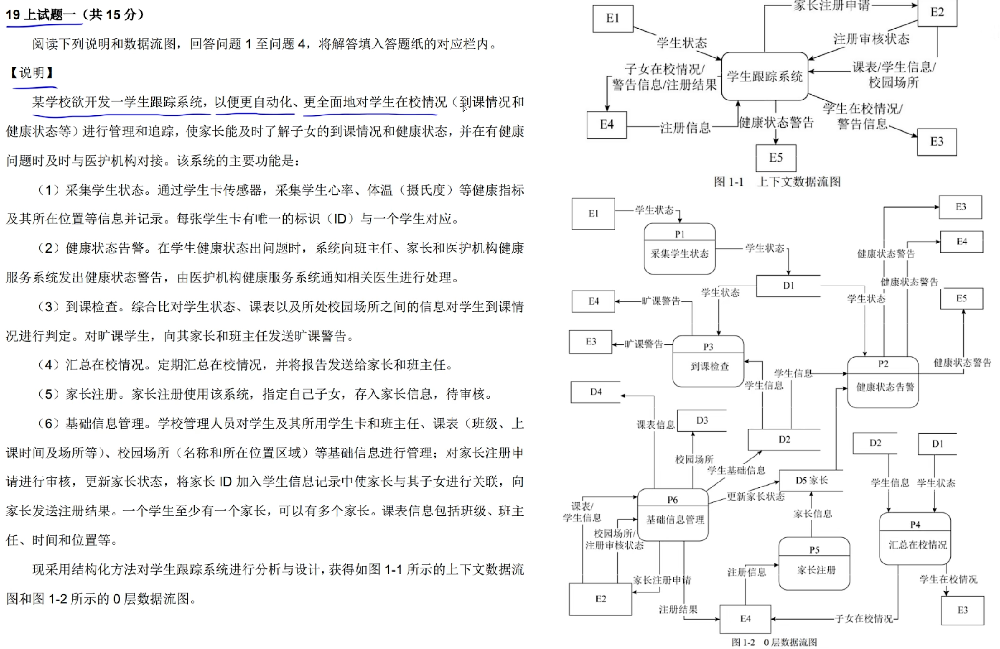
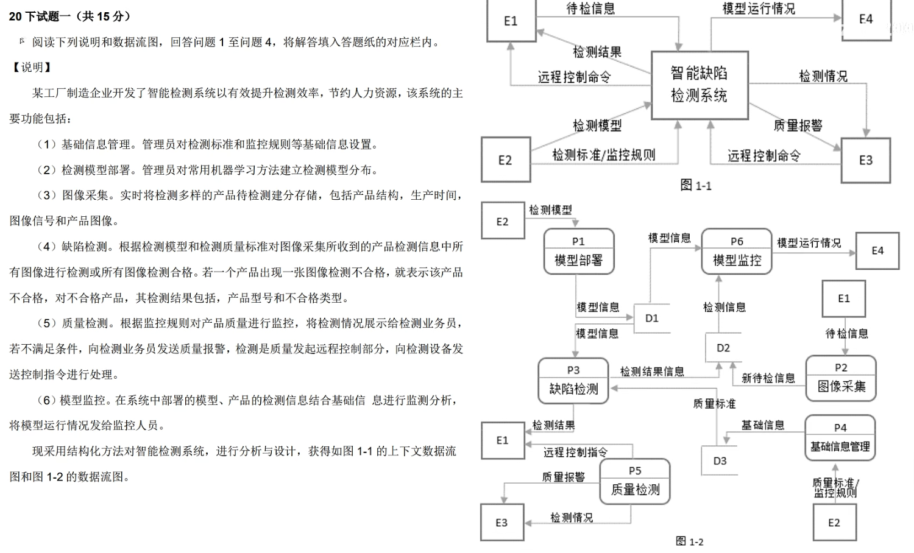

## 下午试题一

### 知识点

#### 结构化语言

介于自然语言和形式化语言之间的半形式化语言，是自然语言的一个受限子集。

IF-THEN-ELSE-ENDIF、CASE—OF—ENDCASE 等关键词语句。

## 真题

### 2019 上



### 2020 下



#### 「问题 1」(4 分) 使用说明中的语句给出图 1-1 中的实体 E1 ～ E4 的名称

- 分析

  - E4 根据（6）中的将 模型运行情况 发送给 监控人员 可以确定 E4 为 「监控人员」

  - E3 可以看到和（5） 相关联，找质量报警 和 检测情况。 根据“将监测情况展示给检测业务员” 可以确定 E3 为 「检测业务员」

  - E1 可以根据 （5）中最后一句“向检测设备发送控制指令进行处理”， 确定 E1 为 「检测设备」

  - E2 可以根据 （1）中的“管理员对检测标准和监控规则等基础信息设置” 和（2）中“管理员对常用机器学习方法建立检测模型分布” ， 确定 E2 为 「管理员」

- 答案

```shell
 - E1 为「检测设备」
 - E2 为「管理员」
 - E3 为「检测业务员」
 - E4 为「监控人员」
```

#### 「问题 2」(3 分) 使用数名中的语句给出图 1-2 中的数据存储 D1 ～ D3 的名称

看 D1、D2、D3 和哪些加工 「也就是矩形」 有相关的数据流，进而找到其名称。

- D1 数据源确认
  - 管理员对常用机器学习方法建立检测模型分布，并对模型信息进行存储
  - 拟定名称 存储的是模型信息 ==> 「模型信息表」
- D2 数据源确认
  - D2 有一条来自 P2(图像采集) 的输入数据流「新待检信息」
  - D2 有一条送往 P3(缺陷检测) 的输出数据流「检测结果信息」
  - 拟定名称 存储的是检测信息 ==> 「检测信息表」
- D3 数据源确认

  - 和 P4(基础信息管理) 有一条输入数据流 「基础信息」， 管理员对检测标准和监控规则等基础信息设置
  - 和 P3(缺陷检测) 有一条输出数据流 「质量标准」，根据**检测模型**和**检测质量**标淮对图像采集所收到的产品检测信息中所有图像进行检测或所有图像检测合格。若一个产品出现一张图像检测不合格，就表示该产品不合格，对不合格产品，其检测结果包括，产品型号和不合格类型。
  - 拟定名称， 存储的是基础信息 包括 检测标准和监控规则。 ==> 「基础信息表」

- 答案

```shell
 - D1 为「模型信息表」
 - D2 为「检测信息表」
 - D3 为「基础信息表」
```

#### 「问题 3」(5 分) 根据说明和图中的术语，补齐图 1-2 中缺失的数据流的名称、起点及终点

- 比较图 1-1、1-2 相同实体是否有相同的输入、输出数据流

  - 发现 1-2 中少一条 E3 的输出数据流 「远程控制命令」。

- 确定每个加工 是不是 既有输出又有输入数据流。

  - 发现 P5(质量检测) 缺少输入数据流， 仅有 3 条输出数据流。

- 看每一个加工 是否跟题干中的描述相同。

  - 发现描述（4）中 “根据检测模型和检测质量标谁对图像采集所收到的产品检测信息中所有图像进行检测或所有图像检测合格” ， 发现加工 P3(缺陷检测) 应由 P2(图像采集) 获得 产品检测信息。 所以推断出缺失数据流为 d2 ----> p3 ， 数据流名称为产品检测信息。
  - P5(质量检测) 缺少输入数据流， 所以重点看描述（5）“根据监控规则对产品质量进行监控”可以推断出缺少监控规则的信息输入流。
    - 进而查找 监控规则 信息输入流在 D3(基础信息表)中。
    - d3 ----> p5 ， 数据流名称为监控规则信息。
  - 描述（5） 最后一句话中“向检测设备发送控制指令进行处理”推断出检测业务员向检测设备发送控制指令进行处理。

    - 推断出 E3 ---> p5, 数据流名称为 控制指令。

  - 描述（6）在系统中部署的模型、产品的检测信息结合基础信息进行监测分析，将模型运行情况发给监控人员。
    - 重点关注 结合基础信息进行监测分析 这句话。
    - 推断出 D3 ---> p6, 数据流名称为 基础信息。

- 答案

```shell
  d2 ----> p3, 数据流名称为 产品检测信息
  d3 ----> p5, 数据流名称为 监控规则信息
  E3 ----> p5, 数据流名称为 控制指令
  d3 ----> p6, 数据流名称为 基础信息
```

#### 「问题 4」(3 分) 根据说明，采用结构化语言对缺陷检测的加工逻辑进行描述

缺陷检测。根据检测模型和检测质量标准对图像采集所收到的产品检测信息中所有图像进行检测或所有图像测合格。若一个产品出现一张图像检测不合格，就表示该产品不合格，对不合格产品，其检测结果包括，产品型号和不合格类型。

- 接受到产品检测信息
- 对产品质量进行检测
  - 合格 （所有图像都合格）
  - 不合格 （一个产品出现一张图像检测不合格）
    - 表示该产品不合格
      - 返回检测结果 = 产品型号 + 不合格类型

```shell
WHILE 收到检测产品的产品检测信息
DO
  检测所有图像
  IF 一个产品出现一张图像检测不合格
      THEN  该产品不合格
            返回不合格产品的检测结果 = 产品型号 +  不合格类型
  ELSE
    THEN  该产品合格
  ENDIF
ENDDO
```

## 常见问题描述

### 第一问 给出实体名称

### 第二问 给出数据存储名称

### 第三问 补充缺失的数据流及其起点和终点

数据流名称 ｜ 起点 ｜ 终点

### 第四问 根据材料 采用结构化语言说明加工逻辑

::: info
对“寻找物流商”加工逻辑进行描述。

系统根据订单的类型（保卖车、全国购和普通二手车）、起止城市、需要的服务模式（买家接、送到买家）进行自动派发或以竞拍体系方式选择合适的物流商。

即有新订单时，若为保卖车或全国购，则直接分配到竞拍体系中；
否则，若符合固定路线和/或包车路线，系统自动分配给合约物流商，若不符合固定路线和包车路线，系统将订单信息分配到竞拍体系中。
竞拍体系接收到订单后，将订单信息推送给有相关路线的物流商，物流商对订单进行竞拍出价，最优报价的物流商中标。
最后，给承运的物流商发送物流消息，更新订单的物流信息，给车辆交易系统发送物流信息。

1.订单分类：
分析订单类型：检查订单是否为保卖车或全国购。如果是，则跳转到竞拍流程；否则，进入下一步。
路线评估：评估订单的起止城市是否匹配固定路线或包车路线。

2.自动派发：
固定路线匹配：如果订单符合固定路线或包车路线，系统直接将订单分配给合约物流商。
无匹配路线：若订单不符合上述条件，将其送入竞拍体系。

3.竞拍流程：
订单发布：将订单信息推送至具有相应路线的物流商群体。
竞拍出价：物流商对订单进行报价。
中标确定：选取报价最优的物流商作为承运商。

4.物流商确认与信息更新：
发送通知：向中标物流商发送物流任务确认信息。
订单状态更新：更新订单的物流信息，包括承运商详情。
系统同步：将更新后的物流信息同步至车辆交易系统，确保信息一致性。
:::

::: details 详细解答

```shell
CASE 订单类型
OF "保卖车", "全国购":
-- 直接进入竞拍体系
将订单推入竞拍体系
OF "普通二手车":
IF 起止城市匹配固定路线 OR 需要包车服务 THEN
-- 自动分配给合约物流商
分配给合约物流商(起止城市, 服务模式)
ELSE
-- 进入竞拍体系
将订单推入竞拍体系
ENDIF
ENDCASE

-- 竞拍体系内部处理
WHILE 订单在竞拍中 DO
接收物流商出价
更新最高报价物流商
ENDWHILE

-- 中标物流商处理
SELECT 中标物流商
发送物流任务确认(中标物流商)
更新订单物流信息(中标物流商信息)
同步信息至车辆交易系统
```

:::
