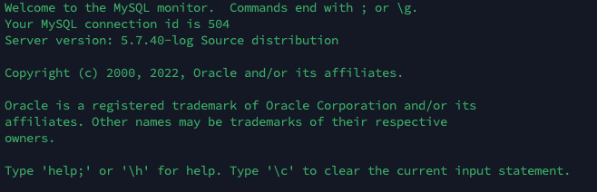
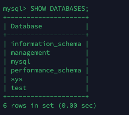

# 基础介绍

RDBMS 关系数据库管理系统 Relational Database Management System

- 数据以表格的形式出现
- 每行为各种记录的名称
- 每列为记录名称所对应的数据域
- 许多的行和列组成一张表单
- 若干的表单组成 database

## 安装

### 查看时候否有 MySQL 进程正在运行

```bash
ps aux | grep mysql
```

### 查看 mysql 版本

```bash
mysql --version
```

### 连接 mysql 服务

在输入密码的时候，密码是不会显示的，确定自己输入正确后回车即可。

```bash
mysql -u root -p
Enter password: ******
```

### 连接成功结果展示



### 查看数据库

```sql
SHOW DATABASES;
```



## 管理

### 启动及关闭 MySQL 服务器

检查 MySQL 服务器是否启动
`ps -ef | grep mysqld`

如果 MySQL 已经启动，以上命令将输出 MySQL 进程列表， 如果 MySQL 未启动，你可以使用以下命令来启动 MySQL 服务器

```bash
root@host# cd /usr/bin
./safe_mysqld &
```

关闭目前运行的 MySQL 服务器

```bash
root@host# cd /usr/bin
./mysql -u root -p shutdown
Enter password: ******
```

### 用户设置

`FLUSH PRIVILEGES` 重新载入授权表。如果你不使用该命令，你就无法使用新创建的用户来连接 MySQL 服务器，除非你重启 MySQL 服务器。

```bash
root@host# mysql -u root -p
Enter password:*******
mysql> use mysql;
Database changed

mysql> INSERT INTO user
          (host, user, password,
           select_priv, insert_priv, update_priv)
           VALUES ('localhost', 'guest',
           PASSWORD('guest123'), 'Y', 'Y', 'Y');

Query OK, 1 row affected (0.20 sec)

mysql> FLUSH PRIVILEGES;
Query OK, 1 row affected (0.01 sec)

mysql> SELECT host, user, password FROM user WHERE user = 'guest';
+-----------+---------+------------------+
| host      | user    | password         |
+-----------+---------+------------------+
| localhost | guest | 6f8c114b58f2ce9e |
+-----------+---------+------------------+
1 row in set (0.00 sec)
```

在添加用户时，请注意使用 MySQL 提供的 PASSWORD() 函数来对密码进行加密。

### 配置文件

路径`/etc/my.cnf` 文件配置

可以修改错误路径

```cnf
[mysqld]
datadir=/var/lib/mysql
socket=/var/lib/mysql/mysql.sock

[mysql.server]
user=mysql
basedir=/var/lib

[safe_mysqld]
err-log=/var/log/mysqld.log
pid-file=/var/run/mysqld/mysqld.pid
```

### 常见表操作名录

- SHOW DATABASES: 列出 MySQL 数据库管理系统的数据库列表。
- SHOW TABLES: 显示指定数据库的所有表，使用该命令前需要使用 use 命令来选择要操作的数据库。
- SHOW COLUMNS FROM 数据表: 显示数据表的属性，属性类型，主键信息 ，是否为 NULL，默认值等其他信息。
- SHOW INDEX FROM 数据表: 显示数据表的详细索引信息，包括 PRIMARY KEY（主键）。
- SHOW TABLE STATUS LIKE 数据表\G: 该命令将输出 MySQL 数据库管理系统的性能及统计信息。

```bash
mysql> SHOW DATABASES;

mysql> SHOW TABLES;

mysql> SHOW COLUMNS FROM user;

mysql> SHOW INDEX FROM user;

mysql> SHOW TABLE STATUS  FROM user;   # 显示数据库 user 中所有表的信息
mysql> SHOW TABLE STATUS from user LIKE 'user%';     # 表名以user开头的表的信息
mysql> SHOW TABLE STATUS from user LIKE 'user%'\G;   # 加上 \G，查询结果按列打印


mysql> CREATE TABLE IF NOT EXISTS tutorials_tbl(
        tutorial_id INT NOT NULL AUTO_INCREMENT,
        tutorial_title VARCHAR(100) NOT NULL,
        tutorial_author VARCHAR(40) NOT NULL,
        submission_date DATE,
        PRIMARY KEY ( tutorial_id )
      ); # 创建表

mysql> DROP TABLE table_name ; # 删除表
```

建表说明：

- 如果你不想字段为 NULL 可以设置字段的属性为 NOT NULL， 在操作数据库时如果输入该字段的数据为 NULL ，就会报错。
- AUTO_INCREMENT 定义列为自增的属性，一般用于主键，数值会自动加 1。
- PRIMARY KEY 关键字用于定义列为主键。 您可以使用多列来定义主键，列间以逗号分隔。

### 常见库操作名录

```bash
mysql> CREATE DATABASE erhang_db; # 创建数据库
# ===> Query OK, 0 rows affected (0.13 sec)

mysql> DROP DATABASE erhang_db; # 删除数据库
# ===> Query OK, 1 row affected (0.04 sec)

mysql> USE erhang_db; # 删除数据库
# ===> Database changed
```

## 使用

### 数据类型

MySQL 支持所有标准 SQL 数值数据类型。

#### 基础类型

这些类型包括严格数值数据类型( INTEGER、SMALLINT、DECIMAL 和 NUMERIC )，以及近似数值数据类型( FLOAT、REAL 和 DOUBLE PRECISION )。

关键字 INT 是 INTEGER 的同义词，关键字 DEC 是 DECIMAL 的同义词。

BIT 数据类型保存位字段值，并且支持 MyISAM、MEMORY、InnoDB 和 BDB 表。

作为 SQL 标准的扩展，MySQL 也支持整数类型 TINYINT、MEDIUMINT 和 BIGINT。下面的表显示了需要的每个整数类型的存储和范围。

| 类型          | 大小（字节）                                  | 范围（有符号）                                                                                                                      | 范围（无符号）                                                    | 用途       |
| ------------- | --------------------------------------------- | ----------------------------------------------------------------------------------------------------------------------------------- | ----------------------------------------------------------------- | ---------- |
| TINYINT       | 1                                             | (-128，127)                                                                                                                         | (0，255)                                                          | 小整数值   |
| SMALLINT      | 2                                             | (-32 768，32 767)                                                                                                                   | (0，65 535)                                                       | 大整数值   |
| MEDIUMINT     | 3                                             | (-8 388 608，8 388 607)                                                                                                             | (0，16 777 215)                                                   | 大整数值   |
| NT 或 INTEGER | 4                                             | (-2 147 483 648，2 147 483 647)                                                                                                     | (0，4 294 967 295)                                                | 大整数值   |
| BIGINT        | 8                                             | (-9 233 372 036 854 775 808，9 223 372 036 854 775 807)                                                                             | (0，18 446 744 073 709 551 615)                                   | 极大整数值 |
| FLOAT         | 4                                             | (-3.402 823 466 E+38，-1.175 494 351 E-38)，0，(1.175 494 351 E-38，3.402 823 466 351 E+38)                                         | 0，(1.175 494 351 E-38，3.402 823 466 E+38)                       | 单精度     |
| DOUBLE        | 8                                             | (-1.797 693 134 862 315 7 E+308，-2.225 073 858 507 201 4 E-308)，0，(2.225 073 858 507 201 4 E-308，1.797 693 134 862 315 7 E+308) | 0，(2.225 073 858 507 201 4 E-308，1.797 693 134 862 315 7 E+308) | 双精度     |
| DECIMAL       | 对 DECIMAL(M,D) ，如果 M>D，为 M+2 否则为 D+2 | 依赖于 M 和 D 的值                                                                                                                  | 依赖于 M 和 D 的值                                                | 小数值     |

#### 日期和时间类型

表示时间值的日期和时间类型为 DATETIME、DATE、TIMESTAMP、TIME 和 YEAR。

每个时间类型有一个有效值范围和一个"零"值，当指定不合法的 MySQL 不能表示的值时使用"零"值。

TIMESTAMP 类型有专有的自动更新特性，将在后面描述。

| 类型      | 大小 (字节) | 范围                                                                                                              | 格式                | 用途                     |
| :-------- | :---------- | :---------------------------------------------------------------------------------------------------------------- | :------------------ | :----------------------- |
| DATE      | 3           | 1000-01-01/9999-12-31                                                                                             | YYYY-MM-DD          | 日期值                   |
| TIME      | 3           | '-838:59:59'/'838:59:59'                                                                                          | HH:MM:SS            | 时间值或持续时间         |
| YEAR      | 1           | 1901/2155                                                                                                         | YYYY                | 年份值                   |
| DATETIME  | 8           | 1000-01-01 00:00:00/9999-12-31 23:59:59                                                                           | YYYY-MM-DD HH:MM:SS | 混合日期和时间值         |
| TIMESTAMP | 4           | 1970-01-01 00:00:00/2038 结束时间是第 2147483647 秒，北京时间 2038-1-19 11:14:07，格林尼治时间 2038-1-19 03:14:07 | YYYYMMDD HHMMSS     | 混合日期和时间值，时间戳 |

#### 字符串类型

字符串类型指 CHAR、VARCHAR、BINARY、VARBINARY、BLOB、TEXT、ENUM 和 SET。该节描述了这些类型如何工作以及如何在查询中使用这些类型。

| 类型       | 大小                 | 用途                            |
| :--------- | :------------------- | :------------------------------ |
| CHAR       | 0-255 字节           | 定长字符串                      |
| VARCHAR    | 0-65535 字节         | 变长字符串                      |
| TINYBLOB   | 0-255 字节           | 不超过 255 个字符的二进制字符串 |
| TINYTEXT   | 0-255 字节           | 短文本字符串                    |
| BLOB       | 0-65 535 字节        | 二进制形式的长文本数据          |
| TEXT       | 0-65 535 字节        | 长文本数据                      |
| MEDIUMBLOB | 0-16 777 215 字节    | 二进制形式的中等长度文本数据    |
| MEDIUMTEXT | 0-16 777 215 字节    | 中等长度文本数据                |
| LONGBLOB   | 0-4 294 967 295 字节 | 二进制形式的极大文本数据        |
| LONGTEXT   | 0-4 294 967 295 字节 | 极大文本数据                    |

提示：CHAR 和 VARCHAR 类型类似，但它们保存和检索的方式不同。它们的最大长度和是否尾部空格被保留等方面也不同。在存储或检索过程中不进行大小写转换。

BINARY 和 VARBINARY 类类似于 CHAR 和 VARCHAR，不同的是它们包含二进制字符串而不要非二进制字符串。也就是说，它们包含字节字符串而不是字符字符串。这说明它们没有字符集，并且排序和比较基于列值字节的数值值。

BLOB 是一个二进制大对象，可以容纳可变数量的数据。有 4 种 BLOB 类型：TINYBLOB、BLOB、MEDIUMBLOB 和 LONGBLOB。它们只是可容纳值的最大长度不同。

有 4 种 TEXT 类型：TINYTEXT、TEXT、MEDIUMTEXT 和 LONGTEXT。这些对应 4 种 BLOB 类型，有相同的最大长度和存储需求。
