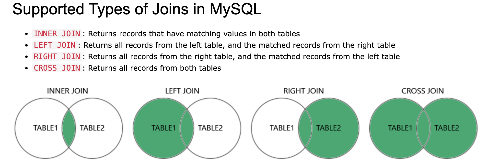

# 基础语法

## 常见注意事项 🍉

- SQL 关键字（如 SELECT、FROM、WHERE 等）在 SQL 查询语句中不区分大小写

## 常用关键字

|       语法       |                                                     用法                                                     | 用法说明                                                                                                       |                                                                             |
| :--------------: | :----------------------------------------------------------------------------------------------------------: | :------------------------------------------------------------------------------------------------------------- | --------------------------------------------------------------------------- |
|      SELECT      |                                            `SELECT * FROM users;`                                            | 从数据库中提取数据。`SELECT` 语句用于查询数据库中的数据，可以指定要检索的列以及条件。                          | 从名为 `users` 的表中选择所有行和所有列                                     |
|      UPDATE      |                             `UPDATE users SET status = 'active' WHERE age = 30;`                             | 更新数据库中的数据。`UPDATE` 语句用于修改数据库表中现有行的数据。                                              | 将名为 `users` 的表中 `age` 列为 30 的所有行的 `status` 列更新为 'active'： |
|      DELETE      |                                      `DELETE FROM users WHERE id = 5; `                                      | 从数据库中删除数据。`DELETE` 语句用于从数据库表中删除符合指定条件的行。                                        | 删除名为 `users` 的表中 `id` 为 5 的行：                                    |
|   INSERT INTO    |                             `INSERT INTO users (name, age) VALUES ('John', 25);`                             | 向数据库中插入新数据。INSERT INTO 语句用于向数据库表中插入新的行，可以指定要插入的列和对应的值。               | 向名为 `users` 的表中插入新的一行：                                         |
| CREATE DATABASE  |                                        `CREATE DATABASE mydatabase;`                                         | 创建一个新数据库。`CREATE` DATABASE 语句用于在数据库管理系统中创建一个新的数据库。                             | 创建名为 `mydatabase` 的新数据库：                                          |
|  ALTER DATABASE  |                              `ALTER DATABASE mydatabase CHARACTER SET utf8mb4;`                              | 修改数据库的结构。`ALTER DATABASE` 语句用于更改数据库的属性，如修改数据库的名称或字符集。                      | 将名为 `mydatabase` 的数据库的字符集修改为 `utf8mb4`：                      |
|   CREATE TABLE   | `CREATE TABLE students (    id INT AUTO_INCREMENT PRIMARY KEY,    name VARCHAR(255) NOT NULL,    age INT );` | 创建一个新表。`CREATE TABLE` 语句用于在数据库中创建一个新的表，可以指定表的列和约束。                          | 在名为 `users` 的数据库中创建一个名为 `students` 的新表：                   |
|   ALTER TABLE    |                              `ALTER TABLE users ADD COLUMN email VARCHAR(255);`                              | 修改现有表的结构。`ALTER TABLE` 语句用于修改数据库中现有表的结构，如添加新列、修改列的数据类型或删除列等操作。 | 向名为 `users` 的表中添加一个新列 `email`：                                 |
|    DROP TABLE    |                                            `DROP TABLE students;`                                            | 删除一个表。`DROP TABLE` 语句用于从数据库中永久删除指定的表以及表中的所有数据。                                | 删除名为 `students` 的表：                                                  |
| **CREATE INDEX** |                                  `CREATE INDEX idx_email ON users (email);`                                  | 创建索引。`CREATE INDEX` 语句用于在数据库表的一个或多个列上创建索引，以提高数据检索的速度。                    | 在名为 `users` 的表的 `email` 列上创建一个索引：                            |
|  **DROP INDEX**  |                                      ` DROP INDEX idx_email ON users;`                                       | 删除索引。`DROP INDEX` 语句用于从数据库表中删除一个或多个索引，通常是因为不再需要该索引或需要重新设计索引。    | 删除名为 `idx_email` 的索引：                                               |

### select

`DISTINCT` 关键字用于去除重复行。

```sql
SELECT DISTINCT column1
FROM table_name;

-- 增加常数列
SELECT '常数名称' as column_name, productId FROM table_name;
```

### where

```sql
SELECT column1, column2, ...
FROM table_name
WHERE condition;
```

### AND OR NOT

```sql
SELECT column1, column2, ...
FROM table_name
WHERE condition1 AND condition2 AND condition3 ...;

SELECT column1, column2, ...
FROM table_name
WHERE condition1 OR condition2 OR condition3 ...;

SELECT column1, column2, ...
FROM table_name
WHERE NOT condition;
```

### ORDER BY

按升序或降序对结果集进行排序。
默认情况下，记录按升序排列。 要按降序对记录进行排序，使用 `DESC` 关键字。

```sql
SELECT column1, column2, ...
FROM table_name
ORDER BY column1, column2, ... ASC|DESC;
```

### INSERT INTO

```sql
# 指定要插入的列名称和值
INSERT INTO table_name (column1, column2, column3, ...)
VALUES (value1, value2, value3, ...);

# 如果要为表的所有列添加值，则不需要在 SQL 查询中指定列名称
# 但是，请确保值的顺序与表中列的顺序相同。
INSERT INTO table_name
VALUES (value1, value2, value3, ...);
```

### NULL Values

`NULL Values` 具有 `NULL` 值的字段是没有值的字段。
如果表中的字段是可选的，则可以插入新记录或更新记录，而无需向该字段添加值。然后，该字段将以 `NULL` 值保存。
`NULL` 值不同于零值或包含空格的字段。具有 `NULL` 值的字段是在记录创建过程中留空的字段！

```sql
SELECT column_names
FROM table_name
WHERE column_name IS NULL;

SELECT column_names
FROM table_name
WHERE column_name IS NOT NULL;
```

### UPDATE

`UPDATE` 语句用于修改表中的现有记录。

```sql
UPDATE table_name
SET column1 = value1, column2 = value2, ...
WHERE condition;

# UPDATE Multiple Records
UPDATE Customers
SET PostalCode = 00000
WHERE Country = 'Mexico';
```

### DELETE

`DELETE` 语句用于删除表中现有的记录。

```sql
DELETE FROM table_name WHERE condition;

# eg
DELETE FROM Customers WHERE CustomerName='Alfreds Futterkiste';

## delete all records
DELETE FROM table_name;
```

### LIMIT Clause

`LIMIT` 关键字用于限制查询结果返回的行数。
`LIMIT` 子句对于具有数千条记录的大型表非常有用。返回大量记录可能会影响性能。

`OFFSET` 关键字用于设置查询结果的偏移量，即从查询结果的起始位置向后移动多少行。

```sql
SELECT column_name(s)
FROM table_name
WHERE condition
LIMIT number;

# 如果你想跳过前 5 行并返回接下来的 10 行结果，可以使用以下语法：
SELECT * FROM table_name LIMIT 10 OFFSET 5;
```

### MIN() and MAX()

`MIN()` 函数返回所选列的最小值。
`MAX()` 函数返回所选列的最大值。

```sql
# MIN
SELECT MIN(column_name)
FROM table_name
WHERE condition;

# MAX
SELECT MAX(column_name)
FROM table_name
WHERE condition;
```

### COUNT(), AVG() and SUM()

COUNT() 函数返回与指定条件匹配的行数。
AVG() 函数返回数字列的平均值。
SUM() 函数返回数字列的总和。

```sql
# count
SELECT COUNT(column_name)
FROM table_name
WHERE condition;

# NULL 值将被忽略。
SELECT AVG(column_name)
FROM table_name
WHERE condition;

SELECT SUM(column_name)
FROM table_name
WHERE condition;
```

### LIKE

```sql
SELECT column1, column2, ...
FROM table_name
WHERE columnN LIKE pattern;

WHERE CustomerName LIKE 'a%'; # : 查找以 "a" 开头的任何值。
WHERE CustomerName LIKE '%a'; # : 查找以 "a" 结尾的任何值。
WHERE CustomerName LIKE '%or%'; # : 查找在任何位置包含 "or" 的任何值。
WHERE CustomerName LIKE '_r%'; # : 查找在第二个位置包含 "r" 的任何值。
WHERE CustomerName LIKE 'a_%'; # : 查找以 "a" 开头且至少长度为 2 的任何值。
WHERE CustomerName LIKE 'a__%'; # : 查找以 "a" 开头且至少长度为 3 的任何值。
WHERE ContactName LIKE 'a%o'; # : 查找以 "a" 开头且以 "o" 结尾的任何值。
```

### Wildcards 通配符

通配符用于替换字符串中的一个或多个字符。
通配符与 LIKE 运算符一起使用。 LIKE 运算符在 WHERE 子句中使用以搜索列中的指定模式。

- `%` 代表零个或多个字符。
- `_` 代表单个字符。

### IN

IN 运算符允许您在 WHERE 子句中指定多个值。
IN 运算符是多个 OR 条件的简写。

```sql
SELECT column_name(s)
FROM table_name
WHERE column_name IN (value1, value2, ...);

SELECT column_name(s)
FROM table_name
WHERE column_name IN (SELECT STATEMENT);
```

### BETWEEN

BETWEEN 运算符选择给定范围内的值。这些值可以是数字、文本或日期。
BETWEEN 运算符是包容性的：包括开始值和结束值。

```sql
SELECT column_name(s)
FROM table_name
WHERE column_name BETWEEN value1 AND value2;

SELECT * FROM Products
WHERE Price BETWEEN 10 AND 20;

SELECT * FROM Products
WHERE Price NOT BETWEEN 10 AND 20;

SELECT * FROM Products
WHERE Price BETWEEN 10 AND 20
AND CategoryID NOT IN (1,2,3);

SELECT * FROM Products
WHERE ProductName BETWEEN "Carnarvon Tigers" AND "Chef Anton's Cajun Seasoning"
ORDER BY ProductName;
```

### AS 别名

别名用于为表或表中的列提供临时名称。
别名通常用于使列名更具可读性。
别名仅在该查询期间存在。
别名是使用 `AS` 关键字创建的。

常见使用场景:

- 一次查询涉及多个表
- 查询中使用了函数
- 列名太大或不太可读
- 两个或多个列组合在一起

```sql
SELECT column_name AS alias_name
FROM table_name;

SELECT column_name(s)
FROM table_name AS alias_name;

# eg column_name
SELECT CustomerName, CONCAT_WS(', ', Address, PostalCode, City, Country) AS Address
FROM Customers;

# eg table_name
SELECT o.OrderID, o.OrderDate, c.CustomerName
FROM Customers AS c, Orders AS o
WHERE c.CustomerName='Around the Horn' AND c.CustomerID=o.CustomerID;
```

### JOIN

JOIN 子句用于根据`两个或多个表之间`的相关列来`组合两个或多个表中的行`。

```sql
SELECT Orders.OrderID, Customers.CustomerName, Orders.OrderDate
FROM Orders
INNER JOIN Customers ON Orders.CustomerID=Customers.CustomerID;
```



#### INNER JOIN

选择在两个表中具有匹配值的记录。 取交集。

```sql
SELECT column_name(s)
FROM table1
INNER JOIN table2
ON table1.column_name = table2.column_name;
```

### LEFT JOIN

`LEFT JOIN` 关键字返回左表 (table1) 中的所有记录以及右表 (table2) 中的匹配记录

```sql
SELECT column_name(s)
FROM table1
LEFT JOIN table2
ON table1.column_name = table2.column_name;
```

### RIGHT JOIN

`RIGHT JOIN` 关键字返回左表 (table1) 中的所有记录以及右表 (table2) 中的匹配记录

```sql
SELECT column_name(s)
FROM table1
RIGHT JOIN table2
ON table1.column_name = table2.column_name;
```

### CROSS JOIN

CROSS JOIN 关键字返回两个表中的所有匹配记录，无论另一个表是否匹配。

如果添加 WHERE 子句（如果 table1 和 table2 有关系），CROSS JOIN 将产生与 INNER JOIN 子句相同的结果

```sql
SELECT column_name(s)
FROM table1
CROSS JOIN table2;

#  如果“Customers”中的某些行在“Orders”中没有匹配项，或者“Orders”中的某些行在“Customers”中没有匹配项，那么这些行也会列出。
SELECT Customers.CustomerName, Orders.OrderID
FROM Customers
CROSS JOIN Orders;

SELECT Customers.CustomerName, Orders.OrderID
FROM Customers
CROSS JOIN Orders
WHERE Customers.CustomerID=Orders.CustomerID;
```

### Self Join

```sql
# T1 和 T2 是同一个表的不同表别名。
SELECT column_name(s)
FROM table1 T1, table1 T2
WHERE condition;

# 从名为 "Customers" 的表中检索数据，使用表别名 "A" 和 "B" 以便在同一表中进行比较。查询的目的是查找同一城市中不同客户的客户名称。
SELECT A.CustomerName AS CustomerName1, B.CustomerName AS CustomerName2, A.City
FROM Customers A, Customers B
WHERE A.CustomerID <> B.CustomerID
AND A.City = B.City
ORDER BY A.City;
```

### UNION

UNION 运算符用于将两个或多个 SELECT 语句的结果集合并在一起。

关于 UNION 运算符的一些要点包括：

每个 SELECT 语句都必须具有相同数量的列。
每个 SELECT 语句中相应的列必须具有相似的数据类型。
每个 SELECT 语句中的列顺序必须相同。
这意味着 UNION 运算符用于合并多个查询的结果集，但要求这些查询的结果具有相同的结构和数据类型。这样可以确保最终合并的结果集是一致的，并且可以正确地进行操作和处理。

```sql
# 结果集中的列名通常等于第一个 SELECT 语句中的列名。
SELECT column_name(s) FROM table1
UNION
SELECT column_name(s) FROM table2;

# 使用 UNION ALL 还可以选择重复值！
SELECT column_name(s) FROM table1
UNION ALL
SELECT column_name(s) FROM table2;


# 从两个不同的表中检索数据，并将结果合并为一个结果集。在结果集中，每一行都包含了 Type、ContactName、City 和 Country 这四个列。
# SQL 别名用于为表或列提供临时名称。
SELECT 'Customer' AS Type, ContactName, City, Country
FROM Customers
UNION
SELECT 'Supplier', ContactName, City, Country
FROM Suppliers;
```

### GROUP BY

GROUP BY 语句将具有相同值的行分组到汇总行中，例如“查找每个国家/地区的客户数量”。

GROUP BY 语句通常与聚合函数（COUNT()、MAX()、MIN()、SUM()、AVG()）一起使用，以按一列或多列对结果集进行分组。

```sql
SELECT column_name(s)
FROM table_name
WHERE condition
GROUP BY column_name(s)
ORDER BY column_name(s);

# 根据 Country 列对 Customers 表中的行进行分组，并计算每个国家的客户数量。
SELECT COUNT(CustomerID) AS CustomerCount, Country
FROM Customers
GROUP BY Country;

SELECT SupplierID, ProductName, SUM(Price) AS TotalPrice
FROM Products
GROUP BY SupplierID, CategoryID;
```

### HAVING

SQL 中添加了 HAVING 子句，因为 WHERE 关键字不能与聚合函数一起使用。

HAVING 子句通常用于对分组后的结果进行筛选，类似于 WHERE 子句，但 HAVING 用于过滤聚合函数的结果，而 WHERE 用于过滤行级别的数据。

```sql
SELECT column_name(s)
FROM table_name
WHERE condition
GROUP BY column_name(s)
HAVING condition
ORDER BY column_name(s);

# 将统计每个国家的客户数量，并且只返回客户数量超过2个的国家
SELECT COUNT(CustomerID) AS CountCustomerId, Country # 计算每个国家的客户数量，并将结果列重命名为 CountCustomerId。
FROM Customers
GROUP BY Country # 根据 Country 列对数据进行分组，这意味着所有具有相同 Country 值的行将被分组到一起。
HAVING COUNT(CustomerID) > 2; # 这个部分是一个筛选条件，它过滤了仅客户数量超过2个的分组。
```

### EXISTS

EXISTS 运算符用于测试子查询中是否存在任何记录。
如果子查询返回一条或多条记录，则 EXISTS 运算符返回 TRUE。

```sql
SELECT column_name(s)
FROM table_name
WHERE EXISTS
(SELECT column_name FROM table_name WHERE condition);

# 列出产品价格小于 20 的供应商
SELECT SupplierName
FROM Suppliers
WHERE EXISTS (SELECT ProductName FROM Products WHERE Products.SupplierID = Suppliers.supplierID AND Price < 20);
```

### ANY and ALL

ANY 和 ALL 运算符允许你在一个列值和一系列其他值之间进行比较。

ANY 运算符：

- 返回一个布尔值作为结果。
- 如果子查询中的`任何值`满足条件，则返回 TRUE。
- ANY 意味着如果操作对范围内的任何值都为真，则条件将为真。

ALL 运算符：

- 返回一个布尔值作为结果。
- 如果子查询中的`所有值`都满足条件，则返回 TRUE。
- 与 SELECT、WHERE 和 HAVING 语句一起使用。
- ALL 意味着只有当操作对范围内的`所有值都为真`时，条件才为真。

::: tip
运算符必须是标准比较运算符（=、<>、!=、>、>=、< 或 <=）
:::

```sql
SELECT column_name(s)
FROM table_name
WHERE column_name operator ANY
  (SELECT column_name
  FROM table_name
  WHERE condition);

SELECT ALL column_name(s)
FROM table_name
WHERE condition;

SELECT column_name(s)
FROM table_name
WHERE column_name operator ALL
  (SELECT column_name
  FROM table_name
  WHERE condition);


# eg
SELECT ProductName
FROM Products
WHERE ProductID = ANY
  (SELECT ProductID
  FROM OrderDetails
  WHERE Quantity = 10);


SELECT ProductName
FROM Products
WHERE ProductID = ALL
  (SELECT ProductID
  FROM OrderDetails
  WHERE Quantity > 10);
```

### INSERT INTO SELECT

INSERT INTO SELECT 语句从一个表复制数据并将其插入到另一表中。
INSERT INTO SELECT 语句要求源表和目标表中的数据类型匹配。

目标表中的现有记录不受影响。

```sql
# 将一个表中的所有列复制到另一表：
INSERT INTO table2
SELECT * FROM table1
WHERE condition;


# 仅将一个表中的某些列复制到另一个表中：
INSERT INTO table2 (column1, column2, column3, ...)
SELECT column1, column2, column3, ...
FROM table1
WHERE condition;
```

### CASE

CASE 语句遍历条件，当满足第一个条件时返回一个值（类似于 if-then-else 语句）。
因此，一旦条件为真，它将停止读取并返回结果。
如果没有条件为真，则返回 ELSE 子句中的值。
如果没有 ELSE 部分并且没有条件为 true，则返回 NULL。

```sql
CASE
    WHEN condition1 THEN result1
    WHEN condition2 THEN result2
    WHEN conditionN THEN resultN
    ELSE result
END;


SELECT
	OrderID,
	Quantity,
CASE

		WHEN Quantity > 30 THEN
		'the quantity is greater than 30'
		WHEN Quantity = 30 THEN
		'The quantity is 30' ELSE 'The quantity is under 30'
	END AS QuantityText
FROM
	OrderDetails;

# 以下 SQL 将按城市对客户进行排序。但是，如果 City 为 NULL，则按 Country 排序

SELECT CustomerName, City, Country
FROM Customers
ORDER BY
(CASE
    WHEN City IS NULL THEN Country
    ELSE City
END);
```

### IFNULL() and COALESCE()

MySQL 中`IFNULL()` 和 `COALESCE()` 函数用于处理 NULL 值。

- IFNULL() 函数：

  - 语法：`IFNULL(expr1, expr2)`
  - 功能：如果 `expr1` 不为 `NULL` ，则返回 `expr1` ；否则，返回 `expr2` 。
  - 示例：`SELECT IFNULL(column_name, 'N/A') FROM table_name;`

- COALESCE() 函数：

  - 语法：`COALESCE(expr1, expr2, ...)`
  - 功能：从一系列表达式中返回第一个非 `NULL` 值。如果所有表达式均为 `NULL` ，则返回 `NULL` 。
  - 示例：`SELECT COALESCE(column1, column2, 'N/A') FROM table_name;`

```sql
#  如果值为 NULL，下面的示例将返回 0：
SELECT ProductName, UnitPrice * (UnitsInStock + IFNULL(UnitsOnOrder, 0))
FROM Products;

SELECT ProductName, UnitPrice * (UnitsInStock + COALESCE(UnitsOnOrder, 0))
FROM Products;
```
